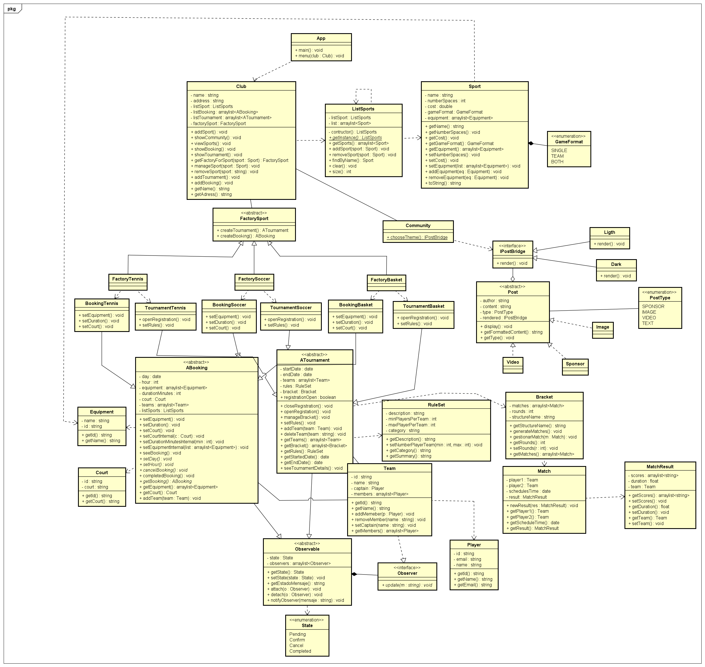

# 📘 Diagrama de Clases UML — Sistema de Gestión de Clubes Deportivos

Este diagrama representa la arquitectura principal del sistema orientado a la gestión de clubes deportivos. Se modelan entidades clave como torneos, publicaciones, reglas, equipos y recursos multimedia, aplicando principios de diseño modular y extensible.

---

## 🏛️ Clase Principal: `Club`

La clase `Club` es el núcleo del sistema. Administra múltiples fábricas y listas de entidades deportivas:

- **Atributos destacados:**
  - `name : string`
  - `listSports : ListSports`
  - Múltiples listas de fábricas: `FactoryTournament`, `FactoryBooking`, `FactoryTeam`, `FactoryPlayer`, etc.

- **Métodos clave:**
  - `createTournament() : Tournament`
  - `createBooking() : Booking`
  - `goalAverage() : string`

---

## 🧩 Composición: `ListSports` y `Sport`

- `ListSports` gestiona una colección de deportes.
  - Métodos: `addSport()`, `removeSport()`, `getSport()`

- Cada `Sport` contiene sus propios recursos:
  - Equipos, jugadores, reglas (`RulesSet`), partidos (`Match`), resultados, brackets, videos, imágenes, patrocinadores.
  - Método común: `goalAverage()`

---

## 🏗️ Fábricas (`FactoryX`)

El sistema utiliza múltiples clases tipo fábrica para instanciar objetos sin acoplar la lógica de negocio:

- Ejemplos: `FactoryTournament`, `FactoryBooking`, `FactoryTeam`, `FactoryPlayer`, `FactoryMatchResult`, etc.
- Permiten crear instancias específicas desde el `Club`.

---

## 🎮 Partidos y Resultados

- `Match` representa un enfrentamiento entre dos equipos (`player1`, `player2`) y su resultado.
- `MatchResult` contiene los puntajes (`scores : List<int>`) y métodos para obtener o modificar resultados.

---

## 🧠 Reglas y Brackets

- `RulesSet` define las reglas de cada deporte:
  - `description : string`
  - `listRules : List<string>`

- `Bracket` organiza los partidos en formato de torneo:
  - `name : string`
  - `listMatches : List<Match>`

---

## 🌐 Comunidad y Publicaciones

- `Community` permite elegir temas visuales (`chooseTheme()`).
- `PostBridge` define tipos de publicación (`PostType`): `IMAGE`, `VIDEO`, `TEXT`.
- `Light` y `Dark` son estilos visuales que implementan `render()`.

---

## 📸 Multimedia y Patrocinadores

- `Image` y `Video` contienen rutas (`path : string`) y métodos para acceder a ellas.
- `Sponsor` incluye nombre y logo, con métodos `getName()` y `getLogo()`.

---

## 🚀 Punto de Entrada: `App`

- Clase principal con método `main()` y `newClub()` para iniciar el sistema.

---

## ✅ Principios de Diseño Aplicados

Este diseño refleja varios principios SOLID:

- **SRP:** Cada clase tiene una responsabilidad clara.
- **OCP:** El sistema es extensible mediante fábricas y renderizadores.
- **DIP:** Se depende de abstracciones (`PostBridge`, `FactoryX`) en lugar de implementaciones concretas.
- **LSP:** Las clases pueden ser sustituidas sin romper el sistema.
- **ISP:** Las interfaces son específicas y no obligan a implementar métodos innecesarios.

---

> Este diagrama proporciona una base sólida para escalar el sistema, integrar nuevas funcionalidades y mantener una arquitectura limpia y profesional.
